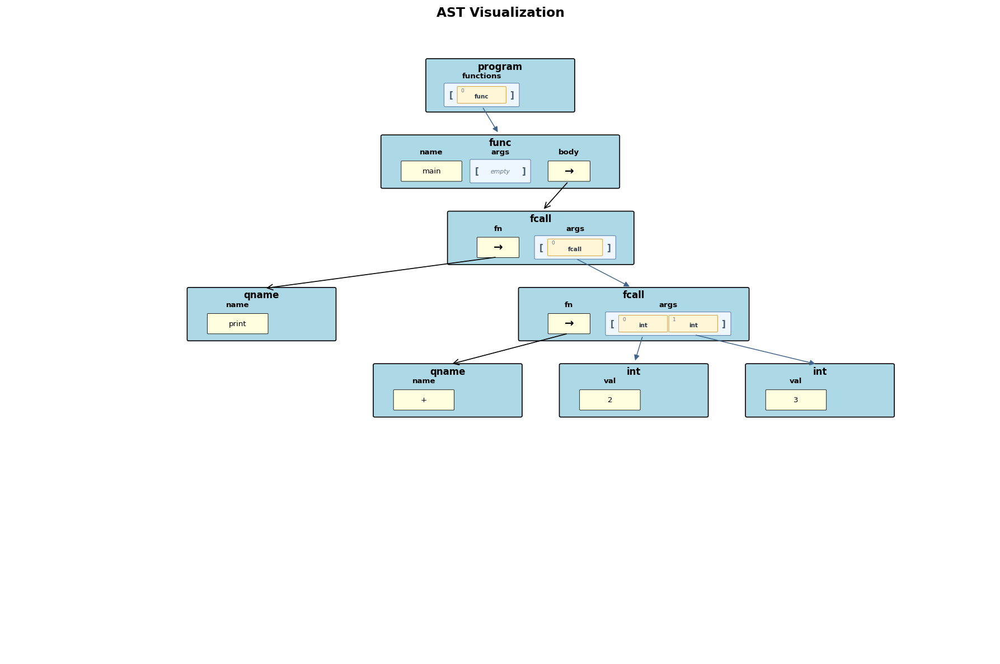
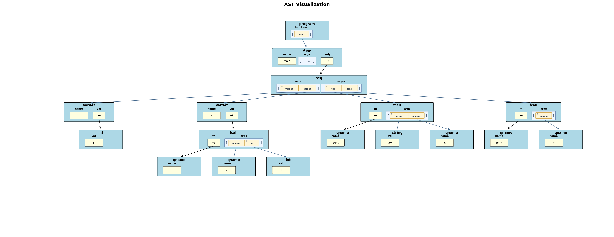
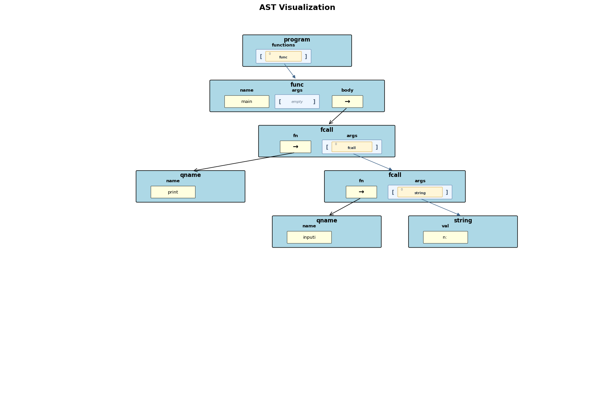

# Project #1: Brewin Lisp-like Interpreter

CS 131 Fall 2026

In this project, you will build the first version of an interpreter for a small
Lisp-like language called Brewin. This first project is intentionally small, but
it is a real interpreter: it reads a program, parses that program into an
abstract syntax tree, evaluates expressions, stores variables, performs input
and output, and reports runtime errors.

You are only required to implement `interpreterv1.py`. The lexer, parser,
abstract syntax tree node class, base interpreter class, and testing harness are
provided for you. Your job is to write the rest of the interpreter which runs synactically-correct programs.

Your Gradescope score is your final score. You may submit to Gradescope as many
times as you like before the deadline, and the last submission score is the score you will receive on the assignment.

WARNING: Do not use LLMs (including autocomplete) to generate code for this project. This will be detected
by Gradescope's cheat-detection framework or a TA and you will have to deal with an academic dishonesty case.

## Links

We will provide the official links for starter code, the
autograder, and any public test cases. This written spec assumes you have the
provided files listed below in the same project directory as your
`interpreterv1.py`:

- `brewlex.py`, the lexer
- `brewparse.py`, the parser
- `element.py`, the AST node class
- `intbase.py`, the base interpreter class and error-type definitions
- `tester.py` and `harness.py`, the local testing framework

## Table of Contents

- [Links](#links)
- [Introduction](#introduction)
- [Brewin Language Introduction](#brewin-v1-language-introduction)
- [A First Example](#a-first-example)
- [What Do You Need To Do For Project #1?](#what-do-you-need-to-do-for-project-1)
- [How To Build An Interpreter](#how-to-build-an-interpreter)
- [Using The Provided Parser](#using-the-provided-parser)
- [Abstract Syntax Trees](#abstract-syntax-trees)
- [AST Node Reference](#ast-node-reference)
- [Brewin Language Spec](#brewin-v1-language-spec)
- [Language Semantics](#language-semantics)
- [Built-in Functions And Operators](#built-in-functions-and-operators)
- [Variables And `seq`](#variables-and-seq)
- [Error Handling](#error-handling)
- [What We Will And Will Not Test](#what-we-will-and-will-not-test)
- [Coding Requirements](#coding-requirements)
- [Deliverables](#deliverables)
- [Grading](#grading)
- [Academic Integrity](#academic-integrity)

## Introduction

Brewin is a variant of Lisp and uses square brackets for nearly everything. A function definition, a
function call, an arithmetic operation, and a sequence expression are all written
as bracketed forms.

For example, this program prints the result of adding 2 and 3:

```brewin
[func main [] [print [+ 2 3]]]
```

This is a Lisp-like style of programming. Instead of writing `2 + 3`, Brewin
uses prefix notation: `[+ 2 3]`. The operator comes first, followed by its operands. Instead
of writing `print(x)`, Brewin writes `[print x]`. Every meaningful piece of
the program is an expression.

The goal of this project is not to write a parser. The parser is already
provided. The parser turns a syntactically valid Brewin program into an abstract
syntax tree (AST). Your interpreter will walk that AST and evaluate it.

## Brewin Language Introduction

A Brewin program is a sequence of function definitions. In this project, the
only allowed function is `main`, and there must be exactly one `main`.

The source form for a function definition is:

```brewin
[func function_name [parameter_names...] body_expression]
```

For Brewin, there must only be a `main`  function, and it must have no parameters (notice the empty parameter list []):

```brewin
[func main [] body_expression]
```

The body of a function is one expression. To refresh your memory, an expression is a syntactically valid piece of a program that, when evaluated in some context, produces a value. Examples of exprssions would be `5 + 6 * 3`, or in Brewin syntax, `[+ 5 [* 6 3]]`. By default, a Brewin function can only evaluate and return the value of a single expression. If you want to evaluate more than one expression in a function, you can a special expression called the `seq` expression, which can execute multiple sub-expressions.

The main expression forms in Brewin are:

- integer literals, such as `0`, `42`, and `999`
- string literals, such as `"hello"` and `"Enter a number: "`
- variable references, such as `x`
- built-in function calls, such as `[print "hello"]`
- arithmetic operators, such as `[+ 2 3]`
- `seq` expressions, which are used to define and initialize local variables and evaluate one or more expressions in order

There are no assignment statements in Brewin because all variables are immutable (they may not be modified after initialization). Local variables may either be formal function parameters, or are defined and initialized in a `seq` expression. After a variable has been created as either a parameter or a local variable, its value may not be changed. It might seem like this would prevent you from writing useful programs, but that's not true! As we'll see in class as we learn Haskell, any program we can create in languages like C++ or Python can be created in languages that have immutable variables!

## A First Example

Here is a complete Brewin program:

```brewin
[func main []
  [seq [[x 5]
        [y 6]]
    [print [+ x y]]]]
```

This program produces:

```text
11
```

Let's walk through the syntax carefully.

The outermost expression is the function definition:

```brewin
[func main [] ...]
```

The word `func` tells the parser that this bracketed form is a function
definition. The name `main` is the name of the function. The empty bracket pair
`[]` after `main` is the parameter list. Brewin requires `main` to have no
parameters, so this list must be empty. The last part of the function definition
is the body expression, which is the expression your interpreter evaluates when
the the main function runs.

In this example, the body expression is a `seq`:

```brewin
[seq [[x 5]
      [y 6]]
  [print [+ x y]]]
```

A `seq` expression has two parts. The first part is the local variable-definition
list:

```brewin
[[x 5]
 [y 6]]
```

This list contains zero or more local variable definitions. Each variable definition is itself a
two-part bracketed form: the variable name followed by its initial value
expression. So `[x 5]` creates a variable named `x` and initializes it to `5`.
Similarly, `[y 6]` creates a variable named `y` and initializes it to `6`. Your interpreter will need
to store these local variables, associating each name like `x` with its value, like `5`.

The second part of the `seq` holds one or more expressions to execute
after the variables have been created. This example has a single such expression:

```brewin
[print [+ x y]]
```

This is a call to the built-in `print` function. Its one argument is the nested
expression `[+ x y]`. To evaluate `[+ x y]`, your interpreter looks up the values
of `x` and `y`, adds them, and gets `11`. Then `print` outputs that value.

Notice that Brewin does not use `=` for variable initialization, and it does
not use semicolons. In a variable definition like `[x 5]`, the position of the
pieces tells you what they mean: first the variable name, then the initializer
expression.

Here is a slightly more complicated program that inputs values from the user during variable
definition:

```brewin
[func main []
  [seq [[first [inputi "Enter first #: "]]
        [second [inputi "Enter second #: "]]
        [sum [+ first second]]]
    [print "first = " first]
    [print "second = " second]
    [print "sum = " sum]]]
```

If the input values are `10` and `20`, the program produces this output (with the user's input shown):

```text
Enter first #: 
10  <- user enters text
Enter second #: 
20  <- user enters text
first = 10
second = 20
sum = 30
```

There are a few important details hidden inside this small example:

- `[inputi "Enter first #: "]` prints the prompt first, then reads one integer
  value from the keyboard. This value (e.g., 10) is used to initialize the `first` variable.
- `[inputi "Enter second #: "]` prints the prompt first, then reads one input
  value. This value (e.g., 20) is used to initialize the `second` variable.
- `[sum [+ first second]]` defines a new `sum` variable using variables that were defined
  earlier in the same `seq`.
- This `seq` body has three expressions: `[print "first = " first]`,
  `[print "second = " second]`, and `[print "sum = " sum]`. They are evaluated
  from top to bottom.
- Each `print` expression prints all of its arguments with no spaces inserted
  between the printed items.
- The `main` function's return value is ignored by the test harness. Only output
  and errors matter.

## What Do You Need To Do For Project #1?

You must implement an `Interpreter` class in `interpreterv1.py`.

Your class must inherit from `InterpreterBase`, which is provided in
`intbase.py`. Our testing framework will create your interpreter object using this
constructor shape:

```python
Interpreter(console_output=True, inp=None, trace_output=False)
```

Your class must also implement this method:

```python
def run(self, program):
    ...
```

The `program` argument is a Python string containing the full source for a Brewin program that is to be interpreted, as it would be read from a source.br file on disk. Your `run()` method should parse the program with our provided `parse_program()` function which yields an AST, then find the `main` function in the AST, and evaluate its expression to run it.

Your interpreter must support:

- one zero-argument function named `main`
- integer and string constant values
- references to defined variables
- `seq` expressions with optional local variable definitions and one or more expressions that are executed in order when the sequence executes (nested sequences do NOT need to be supported)
- print and input expressions: `print` and `inputi`
- arithmetic exprressions `+`, `-`, `*`, and `/` 
- the required runtime errors documented later in this spec

You do not need to write a tokenizer or parser. You also do not need to implement
future-language features that the parser may already recognize, such as `if`,
booleans, lists, or lambdas.

You may add any helper methods or instance variables you like. The tests care
about behavior, not about how you organize your private helper code.

## How To Build An Interpreter

Most interpreters have the same broad shape. They take source code as input,
parse it into an AST, and then evaluate that AST. For this project, the parsing
step is already done for you by `brewparse.py`, so most of your effort should go
into writing recursive evaluation code.

Here is high-level pseudocode for a Brewin interpreter:

```python
class Interpreter:
    def run(self, program):
        self.vars = {}
        ast = parse_program(program)

        main_func_node = get_the_only_function(ast)
        check_that_it_is_valid_main(main_func_node)

        # get the AST node containing the expression that must be executed when main runs 
        body_node = main_func_node.get("body") 
        self.eval_expr(body_node)  # run that expression

    # evaluates an expression and returns the result, e.g., if x is 5, then evaluating 3 + x -> 8 
    def eval_expr(self, expr):
        if expr is an integer node:
            return the integer value stored in the node

        if expr is a string node:
            return the string value stored in the node

        if expr is a variable-name node:
            get the variable name from the node and look up its value in self.vars, then return it

        if expr is a function-call node:
            evaluate the function call

        if expr is a seq node:
            define and initialize all variables and add them to self.vars, then run the sequence's expressions from top to bottom
```

The most important function in your interpreter is usually `eval_expr`. It should accept an AST node and return the value of the expression described in that node. Some expressions, such as `print` and `inputi`, also have side effects. A side effect is something that affects state outside the current function while evaluating an expression, such as printing output or consuming an input value.

For example, to evaluate this expression:

```brewin
[print [+ x y]]
```

your interpreter must:

1. Recognize that the outer node is a function call to `print` which takes 1 or more arguments
2. Evaluate the argument expression `[+ x y]`.
3. To evaluate `[+ x y]`, look up `x`, look up `y`, then add their integer values.
4. Pass the resulting value to `print`.
5. Output the printed string with `super().output(...)`, our provided output function.

When your evaluator reaches a `seq` expression, it should first create the variables that it defines and track them in a mapping data structure, like a dictionary, and then evaluate each expression in its list of expressions in order.

## Using The Provided Parser

Our parser is provided in `brewparse.py`. You should import and use it:

```python
from brewparse import parse_program
```

Inside `run()`, you will typically do something like this:

```python
ast = parse_program(program)
```

The result of calling our `parse_program` function is an `Element` object representing the root node of the AST. The `Element` class is provided in `element.py`. Each `Element` object has:

- `elem_type`, a string telling you what kind of AST node it is
- `dict`, a dictionary holding that node's fields
- `get(key)`, a helper method that returns a field value from the dictionary, or `None`, if the field is missing

You may assume that all test programs we will use to test your interpreter are syntactically valid. If a program has invalid bracket structure or invalid token order, that is our provided parser's problem, not your interpreter's problem.

The parser can also draw an AST if you call it with `plot=True`:

```python
ast = parse_program(program, True)
```

You do not need plotting in your submitted interpreter, but it can be useful
while debugging.

## Abstract Syntax Trees

An abstract syntax tree is a tree-based representation of a program. The parser
removes details like whitespace, brackets and comments and keeps the structure that the
interpreter needs.

For this source program:

```brewin
[func main [] [print [+ 2 3]]]
```

the AST has eight total nodes:



The top node is a `program` node. That node holds a field called `functions` that points to one or more function nodes.  In project #1, the list of functions in the `program` node will contain just a single `func` AST node which defines the `main` function. 

The `func` AST node defines a function. In the above example, it has a `name` field of "main" and a `body` field which points to an AST node which defines the expression to execute when main runs. In this case, the expression to execute is stored in a `fcall` AST node, because the expression main is running is a print call.

The first `fcall` AST node defines a function call operation for printing. It has an `fn` field which points to a `qname` node naming the function that must be called (e.g., print), and an `args` field that lists all argument(s) that are to be passed to that function call. In this case, there is one argument, which points to another `fcall` node which computes 2+3, described just below.

The second `fcall` AST node defines a function call operation for addition. Wait? Is addition implemented as a function call in our AST? Yes! In Brewin, all arithmetic operations are parsed just like function calls. You can think of [+ 2 3] as if it were a function call add(2,3) which returns the sum of its arguments. AST nodes that hold operators have an `fn` field which points to a `qname` node that names the arithmetic operator that must be used (e.g., `+`), and an `args` field that lists the two argument that are to be passed to that operator. In the program above, there are two arguments, which point to an AST node for `2`, and an AST node for `3`.


Here is a larger example using `seq`:

```brewin
[func main []
  [seq [[x 5] [y [+ x 1]]]
    [print "x=" x]
    [print y]]]
```

In the AST for the above program, the `seq` node has one field for variable definitions and another
field for the expressions that make up its body.



Function calls can be nested. In the code below, the argument to `print` is the
result of calling `inputi`:

```brewin
[func main [] [print [inputi "n: "]]]
```

The interpreter must evaluate the inner call before the outer call can finish.



## AST Node Reference

This section describes the AST nodes your Brewin interpreter must be able to correctly handle/process.
The node type names are available as constants on `InterpreterBase`, such
as `InterpreterBase.PROGRAM_NODE` and `InterpreterBase.FCALL_NODE`.

Before looking at each node, keep this mental model in mind: the parser gives
you `Element` objects, not source-code strings. Each `Element` object is an AST node that has two
important instance variables:

- `elem_type`, a string that tells you what kind of AST node this is
- `dict`, a Python dictionary that stores the node's named fields

Each Element object also has a `get(field_name)` method for reading from its
dictionary. In other words, `node.get("name")` returns the same value as
`node.dict["name"]` when the key exists. If the key does not exist, `get()`
returns `None` instead of crashing.

For example:

```python
ast = parse_program(program)

print(ast.elem_type)
print(ast.get("functions"))  # gets a list of functions defined in the Brewin program, equivalent to line below
print(ast.dict["functions"]) # equivalent to line above
```

The `print(ast.elem_type)` above tells you what kind of AST node you are looking at (e.g., a program node, a funcdef node, a fcall node, etc.). The second and third print calls both retrieve the program node's `functions` field. In your interpreter, prefer `get()` because it is concise and handles missing keys gracefully. Most of your interpreter will follow this pattern: look at `elem_type` in an AST node, based on that, get the values you need from its `dict`, recursively evaluate child expression nodes, then using the child node results, evaluate the current node.

### Program Node

A program node represents the whole Brewin program. This is always the root of
the AST returned by `parse_program()`. Your interpreter does not "evaluate" the
program node as an expression. Instead, it uses the program node to find the
function definition for `main`.

```text
elem_type: "program"
dict:
  functions: list of function nodes
```

A complete program like this:

```brewin
[func main [] [print 11]]
```

parses to a program node whose `functions` field contains one function node for the `main` function.

In Brewin, a legal program contains one function definition. Here is a small
Python example showing how you might access that function node after parsing:

```python
ast = parse_program(program)

functions = ast.get("functions")
main_func_node = functions[0]

if main_func_node.get("name") != "main":
    super().error(ErrorType.NAME_ERROR, "main function not found")
```

After this code runs, `main_func_node` refers to an AST node for the `main`
function, whose structure is defined just below.  

### Function Node

A function node represents one function definition from the source program. In
Brewin, the only legal function is `main`, so the job of this node is to
hold the body expression your interpreter should evaluate.

```text
elem_type: "func"
dict:
  name: string
  args: list of parameters
  body: expression node
```

For Brewin, the only legal function name is `main`. The `main` function must
have an empty `args` list. You do not need to inspect individual parameter
nodes in Project 1; just check whether the list is empty.

For this source program:

```brewin
[func main [] [+ 5 6]]
```

the function node has:

```text
name: "main"
args: []
body: points to another AST node which is an fcall node for [+ 5 6]
```

The important idea is that the function node itself is mostly a wrapper. The
actual program work happens when you evaluate the expression referred to in its `body` field.

### Integer Node

An integer node represents a non-negative integer literal from the source code.
Integer nodes are leaf nodes, which means they do not point to any child
expressions. Evaluating an integer node is one of the simplest cases in the
interpreter: return the value stored in its `val` field.

```text
elem_type: "int"
dict:
  val: int
```

Brewin's lexer only supports non-negative integer literals. Negative integer results can
still be produced by expressions such as `[- 0 5]`.

### String Node

A string node represents a double-quoted string literal. Like an integer node,
it is a leaf node. Evaluating it returns the string stored in its `val` field.

```text
elem_type: "string"
dict:
  val: string
```

Our parser removes the surrounding quotation marks before storing the string in
the AST node for you.

### Qualified Name Node

A qualified name node, or `qname`, represents a name in the source program. In
Brewin, the same AST `qname` node type is used for variable names such as `x` and
function names such as `print` when the name appears in function-call AST.

```text
elem_type: "qname"
dict:
  name: string  # a variable or function name used in an expression or definition
```

When a `qname` node is evaluated as a normal expression, it means look up this
variable's name in the interpreter's dictionary of variables and return the value it's associated with.  

### Function Call Node

A function call node represents a call to either a built-in function like `print`, `inputi` or use of an arithmetic
operators like `+` or `/`. Both types of function calls are specified in function call nodes.

```text
elem_type: "fcall"
dict:
  fn: points to a qname node holding the function/operator name (e.g., `print` or `+`)
  args: list of expression nodes
```

For calls such as `[print 1]`, `[inputi]`, and `[+ 2 3]`, the parser
stores the function or operator name in the `fn` field as a `qname` node. This
means normal functions and arithmetic operators have the same AST shape.

For this source program:

```brewin
[func main [] [print "answer = " 11]]
```

the body of `main` is an `fcall` node. Its `fn` field is a `qname` node for
`print`, and its `args` field contains two expression nodes: a string node and
an integer node.

For this source program:

```brewin
[func main [] [+ 2 3]]
```

the body node is also an `fcall`. Its `fn` field is a `qname` node whose name is
`"+"`, and its `args` list contains the two operand expressions. 

After you know the call name, you can iterate through each of the AST nodes listed in the `args` field from left to right, evaluate the expression represented by each node, and then dispatch the function call with its evaluated arguments to the correct built-in operation. 

### Variable Definition Node

A variable definition node appears inside the variable-definition list of a
`seq` expression. It is not an assignment statement. It creates a new variable
and gives that variable its initial value.

```text
elem_type: "vardef"
dict:
  name: string
  val: expression node
```

This node means "create a variable with this name and initialize it to the value
of this expression."  How do you create a variable? Your interpreter will likely need to hold a dictionary (e.g., self.vars) mapping variable names to each variable's constant value.

For this source program:

```brewin
[func main [] [seq [[x 5] [y [+ x 1]]] [print y]]]
```

the `seq` node's `vars` field contains two `vardef` nodes. The first defines
`x`, and the second defines `y`.

When evaluating a variable definition, you can evaluate the initializer expression (e.g., `5` or `[+ x 1]`),
then store the resulting value under the variable's name in your dictionary.

Because variable definitions are processed from left to right, the initializer
for `y` may use the value of `x` in the example above.

### Sequence Node

A sequence node holds a `seq` expression which can define variables and then evaluate one or more of its own "body" expressions in order - this is how a function can execute more than one expression. In this version of Brewin, you do NOT need to support nested sequences.

```text
elem_type: "seq"
dict:
  vars: list of variable definition nodes
  exprs: list of expression nodes to execute in order once variables are defined
```

The source form is:

```brewin
[seq [[name1 expr1] [name2 expr2] ...] body_expr1 body_expr2 ...]
```

For example, the following program defines locals `x` and `y` and then prints their sum, then prints their difference:

```brewin
[func main []
  [seq [[x 5]
        [y 6]]
    [print [+ x y]]
    [print [- x y]]
  ]
]
```

Here, main's function body is a `seq` node.

The variable-definition list may be empty:

```brewin
[seq [] [print 1] [print 2]]
```

The body must contain at least one expression in syntactically valid programs.

An evaluator for `seq` usually follows this algorithm:

```text
evaluate_seq(seq_node):
  for each variable definition in seq_node.dict["vars"]:
    get the variable name
    evaluate the initializer expression

    if the variable name is already defined:
      report ErrorType.NAME_ERROR with super().error(...)

    store the initializer value under the variable name

  result = no value yet

  for each expression in seq_node.dict["exprs"]:
    result = evaluate that expression

  return result
```

The returned value of an expression is the value of the last body expression executed. Earlier body
expressions are still evaluated and each returns a value (becuase every expression returns a value) but all but the last expression's return value are discarded.

## Language Semantics

This section explains what each expression does when it is evaluated.

### Program Evaluation

When `run(program)` is called, your interpreter should:

1. Reset any state from earlier runs, including the variable environment (a dictionary mapping variable names to their values).
2. Parse the source program with `parse_program(program)`.
3. Inspect the program node's `functions` list.
4. Verify that there is exactly one function and that its name is `main`.
5. Verify that `main` takes no arguments.
6. Evaluate the body expression of `main`.

The value returned by `main` is ignored. Any output produced during evaluation, e.g., by a print expression, must still be outputted by `InterpreterBase.output()`.

### Expression Evaluation

Every supported Brewin expression evaluates to a value. The only required
value types are Python `int` and Python `str`.

Evaluation is recursive. For example, to evaluate:

```brewin
[* 2 [+ 3 4]]
```

the interpreter must first evaluate `2`, then evaluate `[+ 3 4]`, then multiply
the resulting values.

Function arguments are evaluated from left to right before the function itself
performs its operation. This matters when an argument has side effects, such as
`print` or `inputi`.

### Integer Literals

An integer node evaluates to its stored integer value.

```brewin
42
```

evaluates to the Python integer `42`.

### String Literals

A string node evaluates to its stored string value.

```brewin
"hello"
```

evaluates to the Python string `"hello"`.

### Variable References

A qualified name used in an expression evaluates to the current value of that
variable.

```brewin
[seq [[x 5]] [print x]]
```

Above, `x` evaluates to `5`.

If the variable has not been defined, this is a name error.

### Function Calls

A function call evaluates all of its argument expressions from left to right and
then executes the requested built-in function or operator on those computed arguments.

The required callable names in Brewin are:

- `print`
- `inputi`
- `+`
- `-`
- `*`
- `/`

Calls to any other name must report a name error by calling
`super().error(ErrorType.NAME_ERROR, ...)`.

## Built-in Functions And Operators

### `print`

Source form:

```brewin
[print arg1 arg2 ... argN]
```

`print` accepts any number of arguments, including zero. Each argument is
evaluated, converted to a string with Python's `str()`, concatenated with the
others, and sent to `InterpreterBase.output()`.

`print` does not insert spaces between arguments.

Examples:

```brewin
[print "hello"]
```

outputs:

```text
hello
```

```brewin
[print 1 " " 2]
```

outputs:

```text
1 2
```

```brewin
[print]
```

outputs one empty line.

After producing its output, `print` evaluates to `0`. Why? Because a print call is an expression, and all expressions must result in a value. We have chosen `0` to be the value returned by print in Brewin. This is why nested print calls behave this way:

```brewin
[func main [] [print [print 5]]]
```

Output:

```text
5
0
```

The inner `[print 5]` outputs `5` and returns `0`. The outer `print` then prints
that returned value.

### `inputi`

Source forms:

```brewin
[inputi]
[inputi prompt_expr]
```

`inputi` reads one input value using `InterpreterBase.get_input()` and should return an integer.

If `inputi` has one argument, that argument is evaluated first and printed as a
prompt using `InterpreterBase.output(str(prompt_value))`. The prompt expression
does not need to be a string. It may be any v1 expression.

Example:

```brewin
[func main [] [print [inputi "n: "]]]
```

If the input is `12`, output is:

```text
n: 
12
```

The value returned by `inputi` is the input converted to a Python integer with
`int(...)`.

If the input cannot be converted to an integer (e.g., the user types in a string like "abc"), `inputi` returns `0`. This is not an error.

Example:

```brewin
[func main [] [print [inputi]]]
```

If the input is `abc`, output is:

```text
0
```

If the provided input list is exhausted and `get_input()` returns `None`,
`inputi` also returns `0`.

If `inputi` is called with more than one argument, your interpreter must report
a name error by calling `super().error(ErrorType.NAME_ERROR, ...)`.

### Arithmetic Operators

Source forms:

```brewin
[+ left right]
[- left right]
[* left right]
[/ left right]
```

Each arithmetic operator takes exactly two operands. The operands are evaluated
from left to right.

Both operands must be integers. If either operand is not an integer, your
interpreter must report a type error by calling
`super().error(ErrorType.TYPE_ERROR, ...)`.

The operators have these meanings:

- `[+ a b]` returns `a + b`
- `[- a b]` returns `a - b`
- `[* a b]` returns `a * b`
- `[/ a b]` returns `a // b`, using Python integer floor division

Examples:

```brewin
[+ 2 3]
```

evaluates to `5`.

```brewin
[- [- 5 2] 10]
```

evaluates to `-7`.

```brewin
[/ 7 2]
```

evaluates to `3`.

You may assume the tests will not require a particular behavior for division by
zero.

### `main` As A Call

We will not test recursive calls to main.

## Variables And `seq`

Brewin uses `seq` to introduce variables and to evaluate multiple expressions
in order.

The source form is:

```brewin
[seq [[name1 init_expr1] [name2 init_expr2] ...]
  body_expr1
  body_expr2
  ...
  body_exprN]
```

A `seq` expression is evaluated in two phases.

First, the interpreter evaluates the variable definitions from left to right.
For each variable definition:

1. Evaluate the initializer expression.
2. Check whether the variable name has already been defined.
3. If the name is new, store the evaluated value under that name.
4. If the name already exists, report a name error by calling
   `super().error(ErrorType.NAME_ERROR, ...)`.

Then the interpreter evaluates the body expressions from left to right.

The value of the whole `seq` expression is the value of its last body expression.
Earlier body expression results are discarded, though their side effects (e.g., inputi, print) still happen.

Example:

```brewin
[func main []
  [seq [[x 5]]
    [+ 1 1]
    [print x]]]
```

Output:

```text
5
```

The expression `[+ 1 1]` is evaluated, but its value is not printed or stored.

### Variable Environment

For Brewin, you must figure out way to keep track of each variable and its value.  This can be a Python dictionary mapping variable names to values.

Variables defined by a `seq` remain available after that `seq` finishes executing. You do not need to implement nested lexical
scopes for Project 1.

Because there is only one function that runs (main) with a single environment, a variable name may be defined at most once during a run. Attempting to define the same name again must report a name error by calling `super().error(ErrorType.NAME_ERROR, ...)`.

For example, this code results is a name error because `x` is defined twice:

```brewin
[func main []
  [seq [[x 3] [x 4]]
    [print x]]]
```

This example is also a name error because we are trying to initialize `x` to `y`'s value before `y` has been defined:

```brewin
[func main []
  [seq [[x y]]
    [print x]]]
```

## Error Handling

Your interpreter must report runtime errors by calling our base class's
`error()` method, normally as `super().error(...)`. Do not manually raise your
own exception type for required Brewin language errors or you will not pass our test cases.

Example:

```python
super().error(ErrorType.NAME_ERROR, "variable not defined")
```

The tests check the `ErrorType`, not the exact error message. Your message may
be different from the examples in this document.

If output happens druing interpretation of a Brewin program and then an error occurs during the same run, that earlier output must remain in the output log. For example:

```brewin
[func main []
  [seq []
    [print "hello"]
    [+ 1 "bad"]]]
```

Expected output and error order:

```text
hello
ErrorType.TYPE_ERROR
```

### Required Failure Modes

The following table lists the runtime failure modes you must handle in your interpreter. For each one, report the listed error type by calling `super().error(required_type, ...)`.

| Situation | Example | Required error type |
| --- | --- | --- |
| No valid `main` function exists | `[func foo [] 5]` | `ErrorType.NAME_ERROR` |
| A function other than `main` is defined | `[func main [] 1] [func helper [] 2]` | `ErrorType.NAME_ERROR` |
| More than one `main` function is defined | `[func main [] 1] [func main [] 2]` | `ErrorType.NAME_ERROR` |
| `main` has parameters | `[func main [x] [print x]]` | `ErrorType.NAME_ERROR` |
| An undefined variable is read | `[func main [] [print x]]` | `ErrorType.NAME_ERROR` |
| A variable name is defined more than once | `[func main [] [seq [[x 5] [x 10]] [print x]]]` | `ErrorType.NAME_ERROR` |
| A call is made to an unknown function | `[func main [] [foo 1]]` | `ErrorType.NAME_ERROR` |
| A computed function position is used | `[func main [] [[print] 1]]` | `ErrorType.NAME_ERROR` |
| `inputi` receives more than one argument | `[func main [] [inputi "a" "b"]]` | `ErrorType.NAME_ERROR` |
| `main` is called with arguments | `[func main [] [main 1]]` | `ErrorType.NAME_ERROR` |
| An arithmetic operand is not an integer | `[func main [] [+ 1 "a"]]` | `ErrorType.TYPE_ERROR` |
| An arithmetic operator receives the wrong number of arguments if such an AST is encountered | internal malformed `fcall` for `+` | `ErrorType.NAME_ERROR` |

The following situations are not errors in Brewin:

- `print` with zero arguments
- `print` with multiple arguments
- `inputi` with zero arguments
- `inputi` receiving non-numeric input
- a `seq` body expression whose value is not used
- a `main` function body that returns a value instead of printing

## What We Will And Will Not Test

You should expect tests for:

- programs with a single valid `main`
- integer and string literals
- calls to `print`
- calls to `inputi`, with and without prompts
- non-numeric input from the keyboard to `inputi`
- integer arithmetic using `+`, `-`, `*`, and `/`
- nested arithmetic expressions
- nested function calls
- `seq` expressions with zero or more variable definitions
- variables whose initializers refer to earlier variables
- multiple body expressions in a `seq`
- all required errors handling listed above

You may assume:

- all test programs are syntactically valid according to the provided parser
- comments and whitespace have already been handled by the lexer and parser
- string escape sequences will not be important for Project 1
- tests will not require a particular behavior for division by zero

## Coding Requirements

Your submitted `interpreterv1.py` must define an `Interpreter` class.

The class must inherit from `InterpreterBase`:

```python
from intbase import InterpreterBase, ErrorType

class Interpreter(InterpreterBase):
    ...
```

Your constructor must be compatible with the testing framework:

```python
def __init__(self, console_output=True, inp=None, trace_output=False):
    super().__init__(console_output, inp)
    ...
```

The `trace_output` argument exists so the testing framework can pass the same
arguments to every project version. You do not need to use it in Project 1.

Your `run()` method must accept the program source as a Python string:

```python
def run(self, program):
    ...
```

For output, always call:

```python
super().output(value_as_string)
```

For input, always call:

```python
super().get_input()
```

For required runtime errors, always call:

```python
super().error(ErrorType.NAME_ERROR, "optional message")
super().error(ErrorType.TYPE_ERROR, "optional message")
```

The exact text of the optional message will not be graded.

## Deliverables

Submit your completed `interpreterv1.py`.

Do not submit changes to the provided lexer, parser, AST element class, base
interpreter class, or testing harness. Those files are provided so you can focus
on the interpreter itself.

Before submitting, make sure your interpreter:

- can be imported without running a program immediately
- defines the required `Interpreter` class
- accepts the required constructor arguments
- implements `run(program)`
- uses the provided parser
- records output through `InterpreterBase.output()`
- reports required errors through `InterpreterBase.error()`
- that you don't use any static/class variables other than constants

```python
class Interpreter:
    i_am_a_static_variable = 10            # this is BAD - don't do this
    i_hold_variable_names_and_values = {}  # this is BAD - don't do this

## Grading

Your grade will be based primarily on correctness as measured by the autograder.
The autograder will instantiate your `Interpreter` class, call `run(program)`,
compare the recorded output against the expected output, and verify that
required runtime failures report the correct `ErrorType`.

You should expect grading to include both visible tests and hidden tests. Hidden
tests may combine features in ways not shown directly in the public examples.
For example, a hidden test might use `inputi` inside a variable initializer, use
nested arithmetic inside a `print`, or produce output before encountering a type
error.

The exact text of your error messages will not be graded. The error type is what
matters. For required language errors, call `super().error(...)` with the
appropriate `ErrorType`.

Programs that do not import, define the required `Interpreter` class, or accept
the expected constructor arguments may receive little or no credit, even if the
interpreter logic is mostly present.

## Academic Integrity

Submit your own work. You may discuss high-level ideas with classmates or LLMs, such as
what an AST is or how recursive evaluation works, but the code you submit must
be written by you. As mentioned in the syllabus, LLM-generated code of any amount is forbidden, including auto-complete.

Do not copy another student's interpreter, share your completed interpreter with
another student, or submit generated code that you do not understand and cannot
explain. Do not modify the provided parser, lexer, base class, or testing
harness as a way to avoid implementing the required interpreter behavior.

If you are unsure whether a tool, collaboration, or outside resource is allowed,
ask the course staff before using it. The safest path is simple: understand the
AST, write your own evaluator, and test it carefully.
